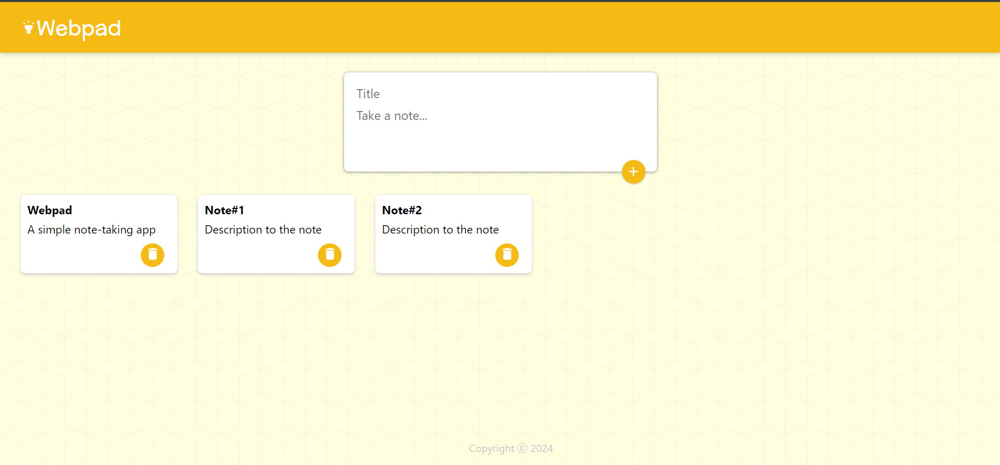

# Webpad App

This is a simple note-taking application built using ReactJS. It allows users to create, view, and delete notes seamlessly.



## Features

- Create new notes with titles and content.
- View existing notes with their titles and content.
- Delete notes to remove them from the app.

## Technologies Used

- **ReactJS:** Used for building the user interface and managing the application's state.
- **CSS:** Used for styling the user interface and enhancing the app's visual appeal.

## Installation

1. Clone the repository:

   ```bash
   git clone https://github.com/vatsalgabani64/Webpad-app.git
2. Navigate to the project directory:

   cd Webpad-app
3. Install dependencies:

   npm install
4. Start the development server:

   npm start
5. Open your browser and visit http://localhost:3000 to view the app.

Usage
1. To create a new note, enter a title and content, and then click on the "+" icon.
2. List of notes will be displayed with their title,content attached.
3. To delete a note, click on the "Delete" icon attached to the note.
